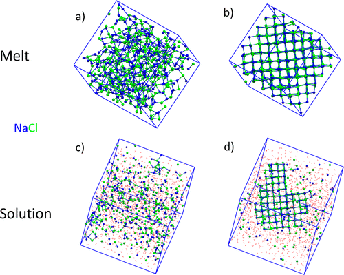

# NaCl_nucleation_melt_aq

The zip file contains essential files to run metadynamics simulations of NaCl nucleation from the melt (the "melt" folder) and aqueous solution (the "aq" folder).

Software: GROMACS-2022.3, PLUMED-2.8.1
